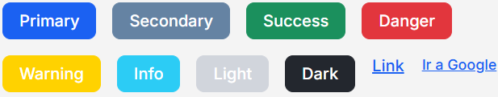
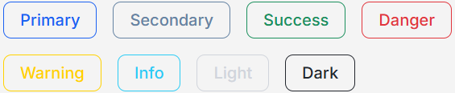
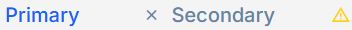
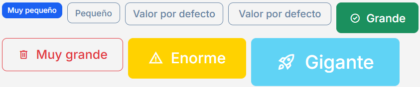
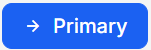

# 🅰️ Angular 21 + Prime NG 21 + Tailwind 4 + Sass

# 🟢 Versión de Node JS

Este proyecto debe ejecutarse utilizando:

```bash
Node JS 24.15.0
```

# 📦 Instalar Paquetes

```javascript
npm i
```

# ▶️ Ejecutar Proyecto

| comando                | apunta a... | ruta archivo                                |
| ---------------------- | ----------- | ------------------------------------------- |
| node --run start:local | local host  | `src/environments/environment.localhost.ts` |
| node --run start:prod  | producción  | `src/environments/environment.prod.ts`      |
| node --run start:test  | pruebas     | `src/environments/environment.test.ts`      |

# 🚀 Generar build (dist) para desplegar

| comando               | apunta a... | ruta archivo                           |
| --------------------- | ----------- | -------------------------------------- |
| node --run build:test | pruebas     | `src/environments/environment.test.ts` |
| node --run build:prod | producción  | `src/environments/environment.prod.ts` |

# 🤖 Uso de IA

> [!WARNING]
> # ⚠️ ****IMPORTANTE**** 🚨
>
> ****Ignorar esta sección ocasionará que la IA genere código que no respete la arquitectura, estructura ni las convenciones del proyecto, produciendo código inconsistentes y desordenadas.****

Para que la IA pueda responder correctamente y respetar la estructura de este proyecto, antes de realizar cualquier pregunta en herramientas de IA como Chat GPT, Claude, Gemini, etc., ***desde aquí en adelante*** debes copiar y pegar completamente este `README.md`.

No debes copiar secciones anteriores del `README.md`.

Debes copiar únicamente el contenido que se encuentra desde aquí hacia abajo, incluyendo todas las secciones posteriores completas y sin omitir información.

## Stack Frontend del Proyecto

* Angular 21
* TypeScript 6
* Prime NG 21
* Tailwind CSS 4
* Sass (versión moderna con `@use` y `@forward`, no utilizar `@import`)
* Luxon
* Material Symbols Icons

## Reglas Obligatorias para la IA

* No generes análisis, recomendaciones ni comentarios adicionales hasta que empiece a realizar preguntas.

* Todas las respuestas, recomendaciones y fragmentos de código deben respetar obligatoriamente la arquitectura, reglas, patrones y convenciones definidas en este documento.

* No cuestiones, reemplaces, contradigas ni ignores las decisiones de arquitectura definidas en este proyecto.

* Siempre que respondas con código, debes indicar explícitamente la ubicación exacta de cada archivo basándote en la estructura base del proyecto definida en este documento.

* Si existe alguna ambigüedad, falta de contexto o algún aspecto importante de arquitectura, estructura o convenciones que no esté definido, primero debes preguntar antes de asumir una implementación.

* Si durante la conversación recibes instrucciones contradictorias, debes priorizar siempre las reglas y decisiones definidas inicialmente en este documento.

* La arquitectura, reglas y convenciones definidas en este documento tienen prioridad absoluta. Sin embargo, como no todos los casos posibles están documentados, si un problema no puede resolverse respetando la arquitectura actual o requiere una solución no contemplada en el README, primero debes advertir explícitamente que dicha solución se sale de la arquitectura o convenciones establecidas antes de generar una implementación.

# 📁 Estructura Base del Proyecto

```txt
src/
├── assets/
│   ├── icon/ → Iconos del proyecto
│   └── img/ → Imágenes del proyecto
│
├── environments/ → variables de entorno
│   ├── environment.interface.ts → Tipos de datos de las variables de entorno
│   ├── environment.localhost.ts → Variables de entorno de local host (desarrollo)
│   ├── environment.prod.ts → Variables de entorno de producción
│   └── environment.test.ts → Variables de entorno de pruebas
│
├── app/
│   ├── app.routes.ts → Definición de rutas (URL)
│   │
│   ├── not-found-404/ → Componente q se muestra al acceder a URLs inexistentes
│   │
│   ├── auth/ → Rutas de autenticación
│   │   ├── assign-password/ → Recuperar y cambiar la contraseña
│   │   ├── login/ → Iniciar sesión
│   │   ├── recover-password/ → Enviar correo para recuperar contraseña
│   │   └── register/ → Formulario de registro de nuevo usuario
│   │
│   └── features/ → Contiene todas las rutas y componentes después de iniciar sesión
│       └── bots/ → Feature independiente que define la ruta `/bots`. El proyecto utiliza una arquitectura basada en funcionalidades (Feature-Based Architecture).
│           ├── bots.component.html
│           ├── bots.component.ts
│           │
│           ├── data-types/ → tipos de datos y constantes utilizados únicamente por la feature bots
│           │   ├── constants/
│           │   ├── interfaces/
│           │   ├── enums/
│           │   └── types/
│           │
│           ├── components/ → componentes reutilizables utilizados únicamente por la feature bots
│           │
│           ├── ui/ → componentes visuales reutilizables utilizados únicamente por la feature bots
│           │
│           ├── services/ → servicios, lógica de negocio y gestión de estado utilizados únicamente por la feature bots
│           │   └── stores/ → estados compartidos por los componentes de la feature bots. Su alcance está limitado a esta feature y no debe utilizarse para compartir estado con otras features ni para estado global de toda la aplicación (feature-wide)
│           │
│           └── utils/
│               └── class/ → clases auxiliares utilizadas únicamente por la feature bots
│
├── shared/ → utilidades compartidas (globales) que se pueden usar en cualquier parte de la web
│   ├── guards/
│   │   └── auth.guard.ts → protección de rutas de todos los componentes que estan despues de loguearse
│   │
│   ├── components/ → componentes que se pueden reutilizzar en varias features
│   │
│   ├── design/ → componentes relacionados con la maquetacion (presentación)
│   │   ├── layouts/ → contenedores que definen la estructura visual y de navegación de una sección completa de la aplicación
│   │   │   └── main-wrapper/ → contenedor principal de paginas despues de loguearse
│   │   │
│   │   └── ui/ → componentes visuales reutilizables que representan partes aisladas de la interfaz, no páginas ni estructuras de navegación completas
│   │       ├── breadcrumbs/ → Componente con migas de pan
│   │       ├── loader/ → icono de cargando
│   │       └── menu/ → Componente de menú
│   │
│   ├── data-types/ → tipos de datos y constantes de la aplicación compartidos entre múltiples features.  A diferencia de `features/*/data-types`, su alcance no está limitado a una sola feature
│   │   ├── constants/
│   │   ├── interface/
│   │   └── enums/
│   │   └── types/
│   │
│   ├── service/ → clases reutilizables usadas para separar lógica reutilizable que no debería estar dentro de los componentes
│   │   ├── api/ → clases encargadas de realizar peticiones HTTP a APIs propias y externas
│   │   │   └── general-api/
│   │   │       ├── http-gateway-async-await.api.ts → Clase legacy mantenida únicamente por compatibilidad para peticiones HTTP usando async/await
│   │   │       └── http-gateway-observable.api.ts → Clase para peticiones HTTP usando Observables
│   │   │
│   │   └── stores/ → estados globales de la aplicación compartidos entre múltiples features. A diferencia de `features/*/store`, su alcance no está limitado a una sola feature
│   │       ├── loader.store.ts → estado global para ocultar y mostrar icono de cargando
│   │       ├── viewport-width.store.ts → estado global con el ancho actual del viewport (pantalla)
│   │       └── current-route.store.ts → estado global con la ruta actual
│   │
│   └── utils/
│       └── class/
│           ├── notification/ → carpeta con funciones para mostrar mensajes emergentes
│           │   ├── HotToastClass.utils.ts → Notificaciones tipo toast
│           │   └── SweetAlertClass.utils.ts → Modal con SweetAlert2
│           │
│           ├── CryptoServiceClass.utils.ts → Encriptar y desencriptar texto y objeto literal usando crypto-js
│           ├── DataTypeClass.utils.ts → funciones para tipos de datos de JS, ejemplo normalizar string
│           ├── DownloadFileClass.utils.ts → funciones para descargar y ver archivos
│           ├── GeneralClass.utils.ts → funciones globales q se pueden re-utilizar en cualquier parte de la web
│           ├── LuxonClass.utils.ts → funciones para fechas usando Luxon
│           └── SessionStorageClass.utils.ts → manejo de `sessionStorage`, codifica y decodifica en Base64 y realiza conversión automática de tipos de datos (string, number, boolean, null, undefined, array y object) al guardar y recuperar la información.
│
└── styles/
    ├── main.scss → con @use importa estilos .scss globales de toda la pagina web, NO debe contener estilos directos
    │
    └── global/ → estilos globales de toda la pagina web
        ├── _reset.scss → elimina los estilos por defecto del navegador para asegurar una apariencia uniforme en todos los navegadores
        ├── _scroll-bar.scss → estilos globales de barra de scroll
        ├── _table.scss → estilos globales para tablas
        ├── _variables.scss → variables globales de Sass
        │
        ├── library/ → estilos que afectan las librerias
        │   ├── _prime-ng.scss → estilos que afectan a Prime NG
        │   ├── _sweet-alert-2.scss → estilos que afectan a Sweet Alert 2
        │   └── _tailwind.css → archivo de configuración de Tailwind 4
        │
        └── buttons/ → estilos globales de botones organizados en archivos .scss composables que permiten combinar variantes, tamaños, estados y temas
            ├── index-buttons.scss → con @use importa estilos .scss para los botones, NO debe contener estilos directos
            ├── _base.scss → Reset CSS para botones
            ├── _effects.scss → utilidades visuales reutilizables para los botones (sombras, blur, filtros, etc.)
            ├── _modifiers.scss → alteran/extienden características de los botones sin sobrescribir sus estilos principales
            ├── _sizes.scss → tamaño de boton
            ├── _states.scss → estados de boton: hover, active, focus, disabled
            ├── _themes.scss → CSS custom properties que definen los colores de los botones
            ├── _tokens.scss → variables de Sass para botones
            └── _variants.scss → Define los estilos del botón (colores, fondo, borde)
```

# 📅 Fechas

Usar la librería **Luxon** para el manejo de fechas. **NO** usar `new Date()` **NI** librerías como Moment.js.

Esto se debe a que:

- `new Date()` tiene comportamientos inconsistentes entre zonas horarias.

- `new Date()` Es difícil de formatear y manipular de forma segura.

- `new Date()` No maneja bien timezones ni conversiones complejas.

- [Moment.js está en modo legacy/deprecado y ya no se recomienda para proyectos modernos.](https://momentjs.com/docs/#/-project-status/)

- Luxon ofrece una API más clara, moderna y robusta para fechas, tiempos y zonas horarias.

**❌ Incorrecto - usar `new Date()`**

```ts
const now = new Date();
const formatted = now.toLocaleDateString();
```

**❌ Incorrecto - usar moment.js**

```ts
import moment from "moment";

const today = moment().format("YYYY-MM-DD");
```

**✅ Correcto - usar Luxon**

```ts
import { DateTime } from "luxon";

const now = DateTime.now();
const formatted = now.toFormat("yyyy-MM-dd");
```

En `src\shared\utils\class\LuxonClass.utils.ts` hay funciones para el manejo (formateo) de fecha y hora usando Luxon.

**❌ Incorrecto - NO usar `formatDate`, usar Luxon directo**

Problemas de este enfoque:

- Repetición de código en múltiples componentes

- cada dev formatea fechas de forma distinta, sin estandarización.

```ts
import { DateTime } from "luxon";

export class BotsComponent {
  getDate() {
    const now = DateTime.now();

    const formatted = now.setLocale("es").toFormat("d-LLL-yyyy hh:mm:ss a");

    console.log(formatted);
  }
}
```

**✅ Correcto - usar `formatDate`**

```ts
import { Component, inject } from "@angular/core";
import { DateTime } from "luxon";
import LuxonClass from "@/shared/utils/class/LuxonClass.utils";

@Component({
  selector: "app-bots",
  templateUrl: "./bots.component.html",
})
export class BotsComponent {
  private dateUtils = inject(LuxonClass);

  getDate() {
    const formatted = this.dateUtils.formatDate(DateTime.now(), "d-LLL-yyyy hh:mm:ss a");

    console.log(formatted);
  }
}
```

En `src\shared\utils\class\LuxonClass.utils.ts` hay función para obtener fecha y hora actual con formato de fecha y hora personalizada

**❌ Incorrecto - usar Luxon directamente para obtener fecha y hora actual**

Problemas de este enfoque:

- Repetición de código en múltiples componentes

- cada dev formatea fechas de forma distinta, sin estandarización.

```ts
import { DateTime } from "luxon";

export class BotsComponent {
  getCurrentDateTime() {
    const now = DateTime.now().setLocale("es").toFormat("d-LLL-yyyy hh:mm:ss a").replace(/\.$/, "");

    const fixed = now.replace(/p\.\s?m/gi, "p.m").replace(/a\.\s?m/gi, "a.m");

    console.log(fixed);
  }
}
```

\***\*✅ Ejemplo correcto - usar `LuxonClass.utils.ts`\*\***

```ts
import { Component, inject } from "@angular/core";
import LuxonClass from "@/shared/utils/class/LuxonClass.utils";

@Component({
  selector: "app-bots",
  templateUrl: "./bots.component.html",
})
export class BotsComponent {
  private dateUtils = inject(LuxonClass);

  getCurrentDateTime() {
    const current = this.dateUtils.currentDateAndTime("d-LLL-yyyy hh:mm:ss a");

    console.log(current);
  }
}
```

# 💅 Maquetación

## 🧱 Configuración de Tailwind 4

[Igual que como se muestra en la documentacion](https://tailwindcss.com/blog/tailwindcss-v4#css-first-configuration)

En este proyecto se está utilizando **Tailwind CSS V4**, por lo tanto el archivo `tailwind.config.js` ya no se utiliza y se considera **obsoleto** en esta arquitectura.

La configuración de Tailwind ahora se realiza en el archivo `src/styles/global/library/tailwind.css`

Esto permite centralizar la definición de tokens de diseño (colores, media queries, etc.) sin necesidad de configuración en archivo JavaScript.

**❌ Incorrecto - Configurar Tailwind 3 con `.js`**

```js
/* tailwind.config.js */

module.exports = {
  theme: {
    extend: {
      colors: {
        "primary-color": "oklch(62.8% 0.258 29.23)" // #FF0000
      },
    },
  },
};
```

**✅ Correcto - Configurar Tailwind 4 con `.css`**

```CSS
/* src/styles/global/library/tailwind.css */

@theme {
  --color-primary-color: oklch(62.8% 0.258 29.23); // #FF0000
}
```

## ⌨️ Configurar Auto-completado y Linter de Tailwind 4

En VS Code o en cualquier editor basado en VS Code (Antigravity, Cursor, Windsurf, etc.), seguir estos pasos;

**1.** Instalar extensión [Tailwind CSS IntelliSense](https://marketplace.visualstudio.com/items?itemName=bradlc.vscode-tailwindcss)

**2.** Instalar extensión [Error Lens](https://marketplace.visualstudio.com/items?itemName=usernamehw.errorlens)

**3.** Abrir el archivo `settings.json`

- Atajo rápido: `Ctrl + Shift + P`
- Luego escribir: `Preferences: Open User Settings (JSON)`

**4.** En `settings.json` agregar esto:

```json
/* Tailwind 4 */
{
  "tailwindCSS.experimental.configFile": "src/styles/global/library/tailwind.css" /* ruta del archivo .css de configuracion de Tailwind 4 */,
  "tailwindCSS.emmetCompletions": true,
  "tailwindCSS.includeLanguages": {
    "javascript": "javascript",
    "javascriptreact": "javascriptreact",
    "plaintext": "html",
    "typescript": "typescript",
    "typescriptreact": "typescriptreact"
  }
}
```

## 🎨 Variables de Colores Tailwind y Sass

Las variables con nombres de los colores de **Sass** en `src/styles/global/_variable.scss` y **Tailwind** en `src/styles/global/library/tailwind.css` tienen que ser exactamente los mismos

Esto garantiza que los colores sean los mismos entre los estilos globales definidos en Sass y los estilos de cada componente definidos con Tailwind.

\***\*✅ Ejemplo:\*\***

En Sass y Tailwind ambos colores tienen exactamente el mismo nombre `primary-color` y son el mismo color rojo `oklch(62.8% 0.258 29.23)`

```scss
// src/styles/global/_variable.scss

// colores de Sass
$primary-color: oklch(62.8% 0.258 29.23); /* #FF0000 */
```

[Documentación de variables de Tailwind 4](https://tailwindcss.com/blog/tailwindcss-v4#css-theme-variables)

```CSS
/*
src/styles/global/library/tailwind.css

colores de Tailwind */

@theme {
  --color-primary-color: oklch(62.8% 0.258 29.23); /* #FF0000 */
}
```

## 🤔 ¿Cómo usar Tailwind y Sass juntos?

\***\*❌ Incorrecto:\*\***

Todos los componentes de Angular **NO** pueden tener archivos de Sass ni CSS con `styleUrls`,

Mezclar Sass y Tailwind en un mismo componente es mala práctica porque los estilos de Sass y Tailwind se sobrescriben debido a la especificidad, herencia y cascada de CSS.

\***\*❌ Ejemplo incorrecto:\*\***

```ts
/* bots.component.ts */

@Component({
  selector: "app-bots",
  templateUrl: "./bots.component.html",
  styleUrls: ["./bots.component.scss"] /*  NO se puede escribir `styleUrls` */,
})
export class BotsComponent {}
```

```HTML
<!-- bots.component.html -->

<button id="btn-guardar"
        class="bg-red-600">
  Guardar
</button>
```

```scss
/* bots.component.scss */

#btn-guardar {
  background-color: red;
}
```

**✅ Correcto:**

Sass para estilos globales en `src/styles/global/...`

Tailwind para estilos especificos de cada componente en `src/app/...` y `src/shared/components/...`

\***\*✅ Ejemplo Correcto de Sass global:\*\***

```scss
// src/styles/global/__scroll-bar.scss

// ocultar barra de scroll, pero hacer q siga funcionando la barra de scroll
.hidden-scrollbar::-webkit-scrollbar {
  display: none;
}
```

```HTML
<!-- my-component-1.component.html -->

<div class="hidden-scrollbar overflow-auto">
  ...
</div>
```

```HTML
<!-- my-component-2.component.html -->

<div class="hidden-scrollbar overflow-auto">
  ...
</div>
```

\***\*✅ Ejemplo Correcto de Tailwind:\*\***

```ts
/* bots.component.ts */

@Component({
  selector: "app-bots",
  templateUrl: "./bots.component.html",
})
export class BotsComponent {}
```

```HTML
<!-- bots.component.html -->

<button class="bg-red-600">
  Guardar
</button>
```

## 🖼️ Ruta de Iconos e Imagenes

Debes crear las siguientes carpetas:

```txt
src/
└── assets/
    ├── icon/
    └── img/
```

**✅ Correcto:**

Al usar la etiqueta ``, siempre utilizar rutas **absolutas** desde `/assets`.

```html
<!-- my-component.component.html -->

<!-- usar slash al principio de /assets -->

```

**❌ Incorrecto:**

**NO** usar rutas **relativas** para acceder a imágenes e iconos

```html
<!-- my-component.component.html -->

<!-- es incorrecto porque se escribe ../ -->

```

```html
<!-- my-component.component.html -->

<!-- es incorrecto porque NO se escribio el slash al principio de assets -->

```

### Imagenes

Las **imágenes** del proyecto se deben guardar dentro de la carpeta:

```txt
src/assets/img/
```

Ejemplo:

```html
<!-- my-component.component.html -->


```

### Iconos

**NO** instales otra libreria para iconos porque en este proyecto es estandar usar [Material Symbols Icons](https://fonts.google.com/icons)

Dar prioridad a usar los iconos de [Material Symbols Icons](https://fonts.google.com/icons)

Usar siempre la siguiente estructura:

```html
<!-- my-component.component.html -->

<span class="material-symbols-outlined"> home </span>
```

La clase:

```html
material-symbols-outlined
```

No debe modificarse ni reemplazarse.

Esa clase es la que permite renderizar correctamente los Material Symbols Icons.

Lo único que debe cambiar es el nombre del icono:

```html
home
```

Dependiendo del icono que se quiera mostrar.

Ejemplos:

```html
<span class="material-symbols-outlined"> delete </span>
```

```html
<span class="material-symbols-outlined"> settings </span>
```

```html
<span class="material-symbols-outlined"> search </span>
```

No agregar imágenes/SVGs manualmente si el icono ya existe en [Material Symbols Icons](https://fonts.google.com/icons)

Cuando el icono no este en [Material Symbols Icons](https://fonts.google.com/icons), entonces agregarlo dentro de la carpeta `src/assets/icon/...`.

Los **iconos** del proyecto se deben guardar dentro de la carpeta

```txt
src/assets/icon/
```

Ejemplo:

```html
<!-- my-component.component.html -->


```

## 🔘 Estilos Globales para Botones

Está guía de estilos para botones está basada en:

- [Arquitectura de Bootstrap 5.3 para botones](https://getbootstrap.com/docs/5.3/components/buttons/)

- [Tailwind 4 font-size](https://tailwindcss.com/docs/font-size)

- [Tailwind 4 line-height](https://tailwindcss.com/docs/line-height)

- [Tailwind 4 padding](https://tailwindcss.com/docs/padding)

La arquitectura está diseñada para proyectos grandes y escalables, separando responsabilidades en:

| Categoría     | Ejemplo de clase | Responsabilidad                                                        |
| ------------- | ---------------- | ---------------------------------------------------------------------- |
| clase base    | `.btn`           | Estilos base para boton (reset CSS para boton, borde redondeado, etc.) |
| variante      | `.btn-primary`   | Variante visual principal                                              |
| variante      | `.btn-secondary` | Variante visual secundaria                                             |
| variante      | `.btn-outline-*` | Agrega estilos con borde                                               |
| tamaño        | `.btn-sm`        | Tamaño pequeño                                                         |
| tamaño        | `.btn-lg`        | Tamaño grande                                                          |
| modificador   | `.btn-icon-only` | Estilos para boton que contiene solamente icono (sin texto)            |

**❌ Incorrecto:**

Usar los [botones de Prime NG](https://primeng.org/button):

* `p-button`

* Atributo `pButton`

* Directivas auxiliares `pButtonLabel` y `pButtonIcon`

```TS
/* my-component.component.ts */

import { ButtonModule } from 'primeng/button';

@Component({
  selector: 'app-my-component',
  templateUrl: './my-component.component.html',
  imports: [ButtonModule],
})

export class MyComponent {}
```

```HTML
<!-- my-component.component.html -->

<p-button label="Guardar" />

<button pButton>
    <i class="pi pi-check" pButtonIcon></i>
    <span pButtonLabel>Guardar</span>
</button>
```

La razón es que los [botones de Prime NG](https://primeng.org/button) agregan estilos por defecto que alteran los estilos globales de `_button.scss`

**✅ Correcto:**

Usar etiqueta `button` nativa de HTML:

```TS
/* my-component.component.ts */

@Component({
  selector: 'app-my-component',
  templateUrl: './my-component.component.html',
})

export class MyComponent {}
```

```HTML
<!-- my-component.component.html -->

<button class="btn btn-primary">
  <span>Guardar</span>
</button>

<button class="btn btn-primary">
  <span class="material-symbols-outlined">arrow_forward</span>
  <span>Primary</span>
</button>
```

**❌ Incorrecto:**

Usar etiquetas `` para iconos porque las imágenes no se integran correctamente con la arquitectura CSS de los botones y dificultan aplicar estilos dinámicos como:

- `color`
- `hover`
- `active`
- `disabled`
- `font-size`
- dark mode

Esto rompe la consistencia visual y vuelve el código más difícil de mantener y escalar.

```html
<button>
  
</button>
```

Por ejemplo, para intentar cambiar color, tamaño o estados visuales de imágenes ``, normalmente se termina recurriendo a hacks visuales con CSS, lo cual es mala práctica:

```SCSS
// cambiar tamaño de imagen
button {
  img {
    display: inline-block;
    width: 20px;
    height: 20px;
  }
}
```

```SCSS
// cambiar color de imagen
img {
  filter: brightness(0) saturate(100%) invert(100%);
}
```

```SCSS
// Recortar la imagen usando la forma del SVG
img {
  mask-image: url(icon.svg);
}
```

```SCSS
// Hacer imagen semitransparente al pasar el mouse
button {
  &:hover {
    img {
      opacity: 0.5;
    }
  }
}
```

Esto genera:

- Son difíciles de mantener.
- Generan inconsistencias visuales.
- Complican los estilos para los estados del botón.
- Rompen fácilmente en dark mode.
- Vuelven el CSS más complejo y frágil.

**✅ Correcto:**

Los iconos de los botones deben utilizar [Material Symbols Icons](https://fonts.google.com/icons)

[Material Symbols Icons](https://fonts.google.com/icons) funcionan como texto estilizable mediante CSS, lo que permite integrarlos correctamente con la arquitectura visual del proyecto.

```html
<button class="btn btn-primary">
  <span class="material-symbols-outlined">arrow_forward</span>
</button>
```

**❌ Incorrecto:**

Usar Tailwind CSS para definir estilos de botones directamente en cada componente, ya que esto suele generar:

```HTML
<button class="rounded-2xl bg-blue-500 hover:bg-blue-600 px-4 py-2 text-white disabled:cursor-not-allowed enabled:cursor-pointer">
  Aceptar
</button>
```

Mezclar las clases globales de botones (`.btn`, `.btn-primary`, `.btn-outline-*`, etc.) con clases de Tailwind CSS.

```HTML
<button class="btn btn-primary bg-red-500 px-10 rounded-full">
  <span class="material-symbols-outlined">save</span>
  <span class="text-blue-500">Guardar</span>
</button>
```

Usar muchas clases de Sass para cada uno de los estilos de los botones, porque mezcla múltiples responsabilidades en una sola clase:

- Icono
- Texto
- Borde

```HTML
<button class="btn-with-icon-text-border">
  <span class="material-symbols-outlined"> home </span>
  <span>Boton</span>
</button>
```

Ese enfoque no escala bien, ya que cada nueva combinación obliga a crear más clases:

```SCSS
.btn-with-icon-text-border-loading {}
.btn-with-icon-text-background-lg {}
.btn-with-icon-text-border-disabled {}
```

Esto genera:

- Archivos Sass enormes y difíciles de mantener.
- Duplicación innecesaria de código.
- Inconsistencias visuales.
- Dificultad para reutilizar un estándar de diseño.

**✅ Correcto:**

Las clases de botones deben representar una sola responsabilidad y ser **composables**.

En arquitectura CSS y de componentes, composable significa que una clase puede combinarse con otras clases pequeñas y reutilizables para construir distintos comportamientos sin duplicar código.

```SCSS
// _base.scss: Reset CSS de boton
.btn {}

// _sizes.scss: tamaño de botones
.btn-sm {}

// _themes.scss: colores de botones
.btn-primary {}

// _modifiers.scss: modificadores
.btn-full-width {}
```

Cada clase modifica únicamente una característica específica del botón:

| Archivo           | Descripción                                                                      | Código de ejemplo    |
| ----------------- | -------------------------------------------------------------------------------- | -------------------- |
| `_base.scss`      | Define los estilos base y el reset CSS de todos los botones.                     | `.btn {}`            |
| `_sizes.scss`     | Define los tamaños disponibles para los botones.                                 | `.btn-sm {}`         |
| `_themes.scss`    | Define los colores y temas visuales de los botones.                              | `.btn-primary {}`    |
| `_modifiers.scss` | Define modificadores que alteran o extienden el comportamiento visual del botón. | `.btn-full-width {}` |


Esto permite combinar comportamientos sin duplicar estilos.

### 📖 Manual de Uso para Dar Estilos a Botones

Esta guía explica cómo utilizar correctamente los estilos globales de botones definidos en:

```txt
src/styles/global/_button.scss
```

### ✨ UI/UX

En el diseño de interfaces (UI/UX), el color de un botón no es solo decorativo:
cada variante representa una intención de acción dentro del sistema.

Esto ayuda al usuario a entender rápidamente qué va a ocurrir antes de hacer clic.

**🔴 Los colores fuertes:**

- Capturan atención.
- Indican importancia.
- El usuario lo identifica como el botón más importante para hacer clic.

**⚪ Los colores suaves o transparentes:**

- Reducen distracción.
- Bajan la jerarquía visual.
- Mantienen el foco en el contenido principal.

**📏 Reglas de UI/UX**

- Solo debe existir 1 acción primaria por pantalla (colores fuertes).
- Las acciones secundarias deben tener menor jerarquía visual (colores suaves).
- Las acciones destructivas deben ser claramente identificables.
- El color no es decoración, es comunicación.

### Clase `.btn` con Estilos Base

La clase `.btn` define los estilos base y actúa como un **reset CSS obligatorio para todos los botones**, sin importar su variante o tipo (`primary`, `outline`, `ghost`, etc.).

Esta clase **siempre debe utilizarse**, ya que establece la estructura común del componente y garantiza consistencia en toda la UI.

Incluye estilos fundamentales como `padding`, `font-size`, alineación del contenido, comportamiento de interacción (`hover`, `active`, `disabled`) y configuración de layout.

Por defecto, `.btn` tiene `background-color: transparent`, por lo que **no representa un botón visual completo por sí sola**. Su función es servir como base para que las variantes (`.btn-primary`, `.btn-outline-*`, etc.) apliquen el estilo visual final.

- Botones **activados** usan `cursor: pointer` 👆🏻 para indicar que el botón es interactivo y puede ser clickeado.

- Botones **desactivados** usan `cursor: not-allowed` 🚫 para indicar que el botón no está disponible y no puede ser clickeado.

```html
<button class="btn">
  Base class
</button>
```

### Botones con Color de Fondo

En sistemas de diseño modernos, los botones se clasifican según su nivel de importancia y riesgo de la acción:

| Tipo de boton    | Significado                                                    |
| ---------------- | -------------------------------------------------------------- |
| 🔵 **Primary**   | acción principal (continuar / confirmar / guardar)             |
| ⚪ **Secondary** | acción secundaria (cancelar / salir)                           |
| 👻 **Ghost**     | acción discreta sin estructura visual fuerte - no tiene border |
| 🔴 **Danger**    | eliminar o destruir                                            |
| 🟡 **Warning**   | advertencia                                                    |
| 🟢 **Success**   | confirmación positiva                                          |
| 🔷 **Info**      | información                                                    |
| 🔗 **Link**      | navegación / enlaces                                           |
| ⚫ **Dark**      | variante de alto contraste para acciones neutras o de soporte  |



```html
<button class="btn btn-primary">Primary</button>
<button class="btn btn-secondary">Secondary</button>
<button class="btn btn-success">Success</button>
<button class="btn btn-danger">Danger</button>
<button class="btn btn-warning">Warning</button>
<button class="btn btn-info">Info</button>
<button class="btn btn-light">Light</button>
<button class="btn btn-dark">Dark</button>

<!-- Enlaces -->
<a class="btn btn-link" routerLink="/home">Link</a>
<a class="btn btn-link" target="_blank" rel="noopener noreferrer" href="https://www.google.com">Ir a Google</a>
```

### Botones con Borde + Texto

Las clases `.btn-outline-*` se usan para botones que tienen `border`, pero no color de fondo `background-color` por defecto.

El comportamiento visual depende del estado de interacción:

- **Estado normal (sin `hover`)** → sin fondo `background-color: transparent` y se muestra únicamente el `border`.

- **Estado `hover`** → botón cambia su `background-color` dependiendo del tipo de botón.

Algunos botones usan colores claros en el texto o borde, por lo que deben colocarse sobre fondos oscuros para mantener un buen contraste y asegurar que sean claramente visibles.



```html
<button class="btn btn-outline-primary">Primary</button>
<button class="btn btn-outline-secondary">Secondary</button>
<button class="btn btn-outline-success">Success</button>
<button class="btn btn-outline-danger">Danger</button>
<button class="btn btn-outline-warning">Warning</button>
<button class="btn btn-outline-info">Info</button>
<button class="btn btn-outline-light">Light</button>
<button class="btn btn-outline-dark">Dark</button>
```

### Botones con Icono

Es obligatorio que, cuando el botón contenga únicamente un icono (sin texto), se utilicen las clases `btn` y `btn-icon-only`.


```HTML
<!-- bordes redondeados -->
<button class="btn btn-icon-only btn-warning">
  <span class="material-symbols-outlined">warning</span>
</button>

<!-- btn-rounded-full forma de circulo -->
<button class="btn btn-icon-only btn-outline-danger btn-rounded-full">
  <span class="material-symbols-outlined">delete</span>
</button>

<button class="btn btn-icon-only btn-ghost btn-rounded-full">
  <span class="material-symbols-outlined">settings</span>
</button>

<!-- xs boton muy pequeño -->
<button class="btn btn-icon-only btn-info btn-rounded-full btn-xs">
  <span class="material-symbols-outlined">info</span>
</button>

<!-- 2xl boton muy grande -->
<button class="btn btn-icon-only btn-primary btn-rounded-full btn-2xl">
  <span class="material-symbols-outlined">arrow_forward</span>
</button>
```

### Botones con Icono + Fondo


```html
<button class="btn btn-icon-only btn-primary">
  <span class="material-symbols-outlined">arrow_forward</span>
</button>

<button class="btn btn-icon-only btn-secondary">
  <span class="material-symbols-outlined">close</span>
</button>

<button class="btn btn-icon-only btn-success">
  <span class="material-symbols-outlined">check_circle</span>
</button>

<button class="btn btn-icon-only btn-danger">
  <span class="material-symbols-outlined">delete</span>
</button>

<button class="btn btn-icon-only btn-warning">
  <span class="material-symbols-outlined">warning</span>
</button>

<button class="btn btn-icon-only btn-info">
  <span class="material-symbols-outlined">info</span>
</button>

<button class="btn btn-icon-only btn-light">
  <span class="material-symbols-outlined">light_mode</span>
</button>

<button class="btn btn-icon-only btn-dark">
  <span class="material-symbols-outlined">dark_mode</span>
</button>
```

### Botones con Borde + Icono


```html
<button class="btn btn-icon-only btn-outline-primary">
  <span class="material-symbols-outlined">arrow_forward</span>
</button>

<button class="btn btn-icon-only btn-outline-secondary">
  <span class="material-symbols-outlined">close</span>
</button>

<button class="btn btn-icon-only btn-outline-success">
  <span class="material-symbols-outlined">check_circle</span>
</button>

<button class="btn btn-icon-only btn-outline-danger">
  <span class="material-symbols-outlined">delete</span>
</button>

<button class="btn btn-icon-only btn-outline-warning">
  <span class="material-symbols-outlined">warning</span>
</button>

<button class="btn btn-icon-only btn-outline-info">
  <span class="material-symbols-outlined">info</span>
</button>

<button class="btn btn-icon-only btn-outline-light">
  <span class="material-symbols-outlined">light_mode</span>
</button>

<button class="btn btn-icon-only btn-outline-dark">
  <span class="material-symbols-outlined">dark_mode</span>
</button>
```

### Botones con Icono + Fondo + Texto


```html
<button class="btn btn-primary">
  <span class="material-symbols-outlined">arrow_forward</span>
  <span>Primary</span>
</button>

<button class="btn btn-secondary">
  <span class="material-symbols-outlined">close</span>
  <span>Secondary</span>
</button>

<button class="btn btn-success">
  <span class="material-symbols-outlined">check_circle</span>
  <span>Success</span>
</button>

<button class="btn btn-danger">
  <span class="material-symbols-outlined">delete</span>
  <span>Danger</span>
</button>

<button class="btn btn-warning">
  <span class="material-symbols-outlined">warning</span>
  <span>Warning</span>
</button>

<button class="btn btn-info">
  <span class="material-symbols-outlined">info</span>
  <span>Info</span>
</button>

<button class="btn btn-light">
  <span class="material-symbols-outlined">light_mode</span>
  <span>Light</span>
</button>

<button class="btn btn-dark">
  <span class="material-symbols-outlined">dark_mode</span>
  <span>Dark</span>
</button>
```

### Botones Redondos

`btn-rounded-full` redondea al maximo las esquinas de cualquier tipo de boton

| Tipo de botón  | Condición (dimensiones) | Resultado visual                                  |
|----------------|-------------------------|---------------------------------------------------|
| Rectangular    | width ≠ height          | Esquinas totalmente redondeadas (forma alargada)  |
| Cuadrado       | width = height          | Círculo perfecto (no óvalo)                       |


```HTML
<button class="btn btn-primary btn-rounded-full">Primary</button>

<button class="btn btn-outline-secondary btn-rounded-full">Secondary</button>

<button class="btn btn-info btn-rounded-full">
  <span class="material-symbols-outlined">info</span>
  <span>Info</span>
</button>

<button class="btn btn-icon-only btn-outline-danger btn-rounded-full">
  <span class="material-symbols-outlined">delete</span>
</button>

<button class="btn btn-icon-only btn-warning btn-rounded-full">
  <span class="material-symbols-outlined">warning</span>
</button>

<!-- SIN btn-rounded-full tiene esquinas redondeadas -->
<button class="btn btn-icon-only btn-success">
  <span class="material-symbols-outlined">check_circle</span>
</button>
```

### Botones sin Fondo ni Borde

`btn-ghost` tiene las siguientes características:

- **Fondo:** transparente.
- **Borde:** inexistente.
- **Color:** usa los mismos colores de las variantes (primary, secondary, success, etc).
- **Hover:** Cambia color de fondo al situar mouse en boton.
- **Uso:** acciones secundarias o discretas.



```HTML
<button class="btn btn-primary btn-ghost">Primary</button>

<button class="btn btn-secondary btn-ghost">
  <span class="material-symbols-outlined">close</span>
  <span>Secondary</span>
</button>

<button class="btn btn-icon-only btn-warning btn-ghost">
  <span class="material-symbols-outlined">warning</span>
</button>
```

### 🚫 Boton desactivado `cursor: not-allowed`

Agregar el atributo booleano de HTML `disabled` a la etiqueta `<button>` hace que los botones tomen estilos de desactivados.

El estilo de boton desactivado se aplica a cualquier tipo de boton.


```HTML
<button disabled class="btn btn-primary">Primary</button>

<button disabled class="btn btn-outline-secondary">Secondary</button>

<button disabled class="btn btn-icon-only btn-outline-danger btn-rounded-full">
  <span class="material-symbols-outlined">delete</span>
</button>

<button disabled class="btn btn-icon-only btn-warning">
  <span class="material-symbols-outlined">warning</span>
</button>

<button disabled class="btn btn-icon-only btn-outline-info">
  <span class="material-symbols-outlined">info</span>
</button>

<button disabled class="btn btn-dark">
  <span class="material-symbols-outlined">dark_mode</span>
  <span>Dark</span>
</button>

<!-- Enlaces -->
<button disabled class="btn btn-link" routerLink="/home">Link</button>
```

### 📐 Tamaños

Puedes modificar el tamaño de cualquier variante de botón, sin importar su estilo (fondo, borde o ghost).

El ajuste de tamaño se aplica a todo el boton y afecta de manera proporcional a todos sus elementos internos:

- Tamaño del botón `padding`.

- Tamaño del texto `font-size`.

- Tamaño de los iconos.

- El espacio entre el icono y el texto `gap` es proporcional al tamaño del botón, ya que utiliza la unidad de medida `em`, la cual depende del `font-size` del propio botón.

El tamaño por defecto de todos los botones es `.btn-base`:

Esto significa que no es necesario declararlo explícitamente: si no se especifica un modificador de tamaño, el botón siempre asumirá este estilo automáticamente.

```SCSS
.btn-base {
  padding: 0.5rem 1rem; // py-2 px-4

  font-size: 1rem; // text-base = 1rem = 16px
  line-height: calc(1.2 / 1); // (line-height que se desea aplicar / font-size)
}
```



```HTML
  <button class="btn btn-primary btn-xs">
    Muy pequeño
  </button>

  <button class="btn btn-outline-secondary btn-sm">
    Pequeño
  </button>

  <button class="btn btn-outline-secondary">
    Valor por defecto
  </button>

  <button class="btn btn-outline-secondary btn-base">
    Valor por defecto
  </button>

  <button class="btn btn-success btn-lg">
    <span class="material-symbols-outlined">check_circle</span>
    <span>Grande</span>
  </button>

  <button class="btn btn-outline-danger btn-xl">
    <span class="material-symbols-outlined">delete</span>
    <span>Muy grande</span>
  </button>

  <button class="btn btn-warning btn-2xl">
    <span class="material-symbols-outlined">warning</span>
    <span>Enorme</span>
  </button>
```

### Modificadores - Boton en Bloque - Responsive

En CSS un elemento en bloque es aquel que ocupa todo el ancho disponible de su contenedor y siempre inicia en una nueva línea ("renglon")

```SCSS
.block {
  display: block;
}
```

```SCSS
.flex {
  display: flex;
}
```

`btn-full-width` convierte el boton a elemento en bloque, hace que el boton ocupe todo al ancho disponible de su contenedor padre y es responsive

Funciona para cualquier variante de botón, sin importar su estilo (fondo, borde o ghost).


```HTML
<!-- solo texto -->
<button class="btn btn-icon-only btn-danger btn-full-width">Danger</button>

<!-- solo icono + fondo -->
<button class="btn btn-icon-only btn-dark btn-full-width">
  <span class="material-symbols-outlined">dark_mode</span>
</button>

<!-- icono + fondo + texto -->
<button class="btn btn-success btn-full-width">
  <span class="material-symbols-outlined">check_circle</span>
  <span>Success</span>
</button>

<!-- icono + borde -->
<button class="btn btn-icon-only btn-outline-info btn-full-width">
  <span class="material-symbols-outlined">info</span>
</button>

<!-- sin fondo ni borde  -->
<button class="btn btn-icon-only btn-primary btn-ghost btn-full-width">
  <span class="material-symbols-outlined">arrow_forward</span>
</button>
```

### Ubicación de Iconos y Texto en Botones

**❌ Incorrecto:**

Usar [flex-direction](https://tailwindcss.com/docs/flex-direction) para cambiar ubicacion de iconos:

```HTML
  <button class="btn btn-primary flex-row-reverse">
    <span class="material-symbols-outlined">arrow_forward</span>
    <span>Primary</span>
  </button>
```

**✅ Correcto:**

Cambiar la ubicación del icono y texto en el HTML, sin usar Sass ni Tailwind.

*icono a la izquierda - texto a la derecha*



```HTML
<button class="btn btn-primary">
  <span class="material-symbols-outlined">arrow_forward</span>
  <span>Primary</span>
</button>
```

*icono a la derecha - texto a la izquierda*


```HTML
<button class="btn btn-primary">
  <span>Primary</span>
  <span class="material-symbols-outlined">arrow_forward</span>
</button>
```

# 🔒 Protección de Rutas

Todas las páginas protegidas de la aplicación deben ser `children` de `MainWrapperComponent`.

Los `children` de `MainWrapperComponent` son las rutas protegidas despues de que el usuario se loguea.

```ts
/* src/app/app.routes.ts */
import { Routes } from "@angular/router";
import { AuthGuard } from "@/shared/guards/auth.guard";

// #region - contenedor principal de paginas despues de loguearse
import { MainWrapperComponent } from "@/app/features/main-wrapper/main-wrapper.component";
// #endregion

import { BotsComponent } from "@/app/features/bots/bots.component";

export const routes: Routes = [
  {
    path: "",
    component: MainWrapperComponent,

    canActivate: [AuthGuard],
    canActivateChild: [AuthGuard],

    children: [
      {
        // /bots
        path: "bots",
        component: BotsComponent,
      },
    ],
  },
];
```

# 🔀 Enrutado

El nombre de las carpetas dentro de `src/app` tiene que coincidir exactamente con las rutas definidas en `src/app/app.routes.ts`

Esto permite ubicar los componentes que corresponden a cada URL

Además,

**✅ Correcto:**

```txt
src/app/
├── features/
│     └── bots/
│         └── bots.component.html
│         └── bots.component.ts
```

```ts
/* src/app/app.routes.ts */
import { Routes } from "@angular/router";
import { AuthGuard } from "@/shared/guards/auth.guard";

// #region - contenedor principal de paginas despues de loguearse
import { MainWrapperComponent } from "@/app/features/main-wrapper/main-wrapper.component";
// #endregion

import { BotsComponent } from "@/app/features/bots/bots.component";

export const routes: Routes = [
  {
    path: "",
    component: MainWrapperComponent,

    canActivate: [AuthGuard],
    canActivateChild: [AuthGuard],

    children: [
      {
        // /bots
        path: "bots",
        component: BotsComponent,
      },
    ],
  },
];
```

En este ejemplo:

- La URL `/bots` coincide con la estructura `src/app/features/bots`

- `BotsComponent` es hijo de `MainWrapperComponent`

- `AuthGuard` protege automáticamente todas las rutas hijas gracias a `canActivateChild`

# 🧩 Organización de componentes

Los componentes que pertenecen a una URL o página específica deben estar dentro de su módulo o ruta correspondiente en `src/app`.

Los componentes reutilizables y compartidos entre múltiples páginas deben estar en `src/shared/components`.

Esto permite mantener una arquitectura escalable.

**✅ Correcto:**

```txt
src/
├── app/
│   ├── features/
│   │   ├── bots/
│   │   │   ├── bots.component.ts
│   │   │   ├──  bots.component.html
│   │   │   ├──  bots.component.spec.ts
│   │   │   │
│   │   │   └── components/
│   │   │       └── bot-card/
│   │   │           ├── bot-card.component.ts
│   │   │           ├── bot-card.component.html
│   │   │           └── bot-card.component.spec.ts
│
├── shared/
│   └── components/
│       ├── button/
│       ├── modal/
│       └── spinner/
```

En este ejemplo:

- `bot-card.component.ts` pertenece únicamente a la página de bots

- `button`, `modal` y `spinner` son componentes reutilizables globales

- Cada funcionalidad (_feature_) mantiene sus componentes encapsulados

**❌ Incorrecto:**

```txt
src/
├── components/
│   ├── bots/
│   │   ├── bots.component.ts
│   │   ├── bots.component.html
│   │   └── bots.component.spec.ts
│   │
│   ├── botbot-cards/
│   │   ├── bot-card.component.ts
│   │   ├── bot-card.component.html
│   │   └── bot-card.component.spec.ts
│   │
│   ├── home-banner/
│   │   ├── home-banner.component.ts
│   │   ├── home-banner.component.html
│   │   └── home-banner.component.spec.ts
│   │
│   ├── button/
│   │   ├── button.component.ts
│   │   ├── button.component.html
│   │   └── button.component.spec.ts
│   │
│   ├── modal/
│   │   ├── modal.component.ts
│   │   ├── modal.component.html
│   │   └── modal.component.spec.ts
│   │
│   └── spinner/
│       ├── spinner.component.ts
│       ├── spinner.component.html
│       └── spinner.component.spec.ts
```

No se debe meter todo en una carpeta global `src/components` porque:

- Mezcla componentes reutilizables con componentes específicos de páginas

- Dificulta encontrar archivos relacionados con una funcionalidad

- Genera desorden a medida que crece el proyecto

- Rompe el encapsulamiento de cada módulo o página

- Es inmantenible e inescalable

## Diferencia entre `src/app/bots/components` y `src/shared/components`

- `src/app/bots/components` contiene componentes exclusivos de la funcionalidad (feature) `bots`

- Estos componentes no deben reutilizarse globalmente porque pertenecen únicamente a esa página o _feature_

- `src/shared/components` contiene componentes reutilizables en toda la aplicación

- Los componentes compartidos deben ser genéricos y desacoplados de una funcionalidad específica

# 🌐 Consumo de API

En este proyecto todas las peticiones HTTP deben hacerse usando el servicio centralizado `src\shared\API\general-api\http-gateway-observable.api.ts`, que maneja:

- icono de loader global

- manejo de errores `catchError`

- timeout

- logging

- logger

- validaciones de seguridad (guards)

- respuesta estándar con el tipo

```ts
{
  success: boolean;
  status: number;
  message: string;
  data: T;
}
```

## ❌ Forma incorrecta

No se debe consumir la API directamente con `HttpClient` + `try/catch` en componentes o servicios externos.

**NO** es necesario escribir `try/catch` porque la clase `http-observable.service.ts` ya se encarga de manejar los errores.

❌ Problemas de este enfoque:

- Repite lógica en cada componente.

- No tiene loader global.

- No tiene manejo estandarizado de errores.

- No respeta arquitectura del proyecto.

- Usa `try/catch` en cada llamada.

- No centraliza validaciones ni logging.

\***\*❌ Ejemplo incorrecto - `lastValueFrom`\*\***

```ts
import { HttpClient } from "@angular/common/http";
import { lastValueFrom } from "rxjs";

export class BotsComponent {
  constructor(private http: HttpClient) {}

  async getBots() {
    try {
      const data = await lastValueFrom(this.http.get("https://api.com/bots"));

      console.log(data);
    } catch (error) {
      console.error("Error API", error);
    }
  }
}
```

\***\*❌ Ejemplo incorrecto - `firstValueFrom`\*\***

```ts
import { HttpClient } from "@angular/common/http";
import { firstValueFrom } from "rxjs";

export class BotsComponent {
  constructor(private http: HttpClient) {}

  async getBots() {
    try {
      const data = await firstValueFrom(this.http.get("https://api.com/bots"));

      console.log(data);
    } catch (error) {
      console.error("Error API", error);
    }
  }
}
```

\***\*❌ Ejemplo incorrecto - Angular legacy - `toPromise()`\*\***

Antes de `firstValueFrom`, en Angular antiguo se usaba `toPromise()`, pero este enfoque está **deprecado** y ya no se recomienda.

```ts
import { HttpClient } from "@angular/common/http";

export class BotsComponent {
  constructor(private http: HttpClient) {}

  async getBots() {
    try {
      const data = await this.http.get("https://api.com/bots").toPromise();

      console.log(data);
    } catch (error) {
      console.error("Error API", error);
    }
  }
}
```

\***\*❌ Ejemplo incorrecto - observable\*\***

```ts
import { HttpClient } from "@angular/common/http";

export class BotsComponent {
  constructor(private http: HttpClient) {}

  getBots() {
    this.http.get("https://api.com/bots").subscribe({
      next: (data) => {
        console.log(data);
      },
      error: (error) => {
        console.error("Error API", error);
      },
    });
  }
}
```

\***\*❌ Ejemplo incorrecto - `fetch`\*\***

Angular no usa `fetch` porque es una API básica del navegador y no se integra con la arquitectura del framework.

```ts
export class BotsComponent {
  async getBots() {
    try {
      const response = await fetch("https://api.com/bots");

      const data = await response.json();

      console.log(data);
    } catch (error) {
      console.error("Error API", error);
    }
  }
}
```

## ✅ Forma correcta

Se debe usar únicamente el ApiGatewayService (`src/services/api/general-api/http-gateway-observable.api`) centralizado.

- NO usar `try/catch` aquí

- El servicio `http-observable.service.ts` ya maneja errores internamente

- La URL se construye concatenando el `environment.api` con el endpoint específico de la petición, lo que permite reutilizar la base de la API en todos los ambientes (local, test, producción).

\***\*✅ Ejemplo correcto con `http-observable.service.ts` y `firstValueFrom`\*\***

```ts
import { inject } from "@angular/core";
import { ApiGatewayService } from "@/shared/services/api/general-api/http-gateway-observable.api";
import { IResponse } from "@/shared/api/general-api/types/request-data.types";
import { environment } from "@/environments/environment";

export class BotsComponent {
  http = inject(ApiGatewayService);

  async getBots() {
    const { success, status, message, data }: IResponse = await firstValueFrom(
      // aqui se concatena el environment.api con el endpoint específico de la petición
      this.http.POST(`${environment.api}AQUI_ESCRIBIR_EL_ENDPOINT`),
    );

    console.log("¿la peticion HTTP es exitosa o erronea? ", success);
    console.log("numero de HTTP status", status);

    if (success) {
      console.log("peticion HTTP exitosa");
      console.log("mensaje con que responde la API", message);
      console.log("datos con que responde la API", data);
    } else {
      console.error("error al llamar la API");
    }
  }
}
```

# ⏳ Icono de Loader Global

El icono de carga se oculta y muestra automáticamente desde `http-observable.service` y `loader.service.ts` cuando se realizan peticiones HTTP.

👉 **NO se debe crear estados manuales como `loader = true/false` en los componentes**, ya que el loader es global y centralizado.

\***\*❌ Ejemplo incorrecto\*\***

Crear estados locales de loading en cada componente:

```ts
/* bots.component.ts */

export class BotsComponent {
  loading: boolean = false;

  getBots() {
    this.loading = true;

    this.http.get("https://api.com/bots").subscribe({
      next: (res) => {
        console.log(res);
        this.loading = false;
      },
      error: (err) => {
        console.error(err);
        this.loading = false;
      },
    });
  }
}
```

```HTML
<!-- bots.component.html -->

<button (click)="getBots()">
  Obtener bots
</button>

@if (loading) {
  <div>
    Cargando...
  </div>
} @else {
  <div>
    Aquí se muestran los bots
  </div>
}
```

❌ Problemas de este enfoque:

- Duplica codigo para mostrar y ocultar icono de cargando en cada componente

- El loader no es global

- Riesgo de olvidar ocultar el icono de cargando

- Cuando hay varias peticiones HTTP en un mismo componente se vuelve muy complejo saber en donde escribir `loader = true/false` para mostrar y ocultar el icono de cargando.

\***\*✅ Ejemplo correcto con `http-observable.service.ts`\*\***

```ts
import { inject } from "@angular/core";
import { ApiGatewayService } from "@/shared/services/api/general-api/http-gateway-observable.api";
import { IResponse } from "@/shared/api/general-api/types/request-data.types";
import { environment } from "@/environments/environment";

export class BotsComponent {
  http = inject(ApiGatewayService);

  async getBots() {
    const { success, status, message, data }: IResponse = await firstValueFrom(this.http.POST(`${environment.api}`, optionsApi));

    if (success) {
      // ...
    } else {
      // ...
    }
  }
}
```

# ⚙️ Configuración de peticiones HTTP (`IRequestOptions`)

En este proyecto todas las peticiones realizadas con `http-observable.service.ts` pueden configurarse mediante la interfaz `IRequestOptions`.

Esto permite estandarizar el comportamiento de las llamadas HTTP sin repetir lógica en los componentes.

## 📦 ¿Qué permite configurar?

```ts
/* src\shared\API\general-api\types\request-data.types.ts */

export interface IRequestOptions<T = any> {
  body?: T;
  params?: TParams;
  headers?: THeaders;
  responseType?: IResponseType;

  showLoader?: boolean;
  showLogger?: boolean;
  executeErrorHandling?: boolean;

  isASecurityEndpoint?: boolean;
  withCredentials?: boolean;
}

/**
tipo de respuesta HTTP */
export type IResponseType = "arraybuffer" | "blob" | "json" | "text";
```

### 🧠 Explicación de opciones

- `body` → datos enviados en POST, PUT o PATCH
- `params` → query params de la URL
- `headers` → headers personalizados
- `responseType` → tipo de respuesta 'arraybuffer' | 'blob' | 'json' | 'text'

### 🎛️ Opciones de comportamiento global

- `showLoader` → muestra/oculta el loader global
- `showLogger` → activa logs de request/response
- `executeErrorHandling` → ejecuta manejo de errores centralizado

### 🔐 Seguridad y autenticación

- `isASecurityEndpoint` → indica si requiere token o autenticación
- `withCredentials` → envía cookies y credenciales en requests cross-domain

### 🚀 Beneficio principal

👉 Permite que todas las peticiones HTTP tengan un comportamiento consistente, reutilizable y centralizado sin repetir lógica en cada componente o servicio.

### 📦✅ Ejemplo de consumo de API con `POST` y `body`

Enviar datos al backend usando `POST` y el `body` de `IRequestOptions`.

```ts
import { Component, inject } from "@angular/core";
import { ApiGatewayService } from "@/shared/services/api/general-api/http-gateway-observable.api";
import { firstValueFrom } from "rxjs";
import { environment } from "@/environments/environment";
import { IResponse } from "@/shared/api/general-api/types/request-data.types";

interface IBodyBots {
  name: string;
  active: boolean;
}

@Component({
  selector: "app-bots",
  templateUrl: "./bots.component.html",
})
export class BotsComponent {
  private http = inject(ApiGatewayService);

  async createBot() {
    const optionsApi: IRequestOptions<IBodyBots> = {
      body: {
        name: "Bot IA",
        active: true,
      },
    };

    const { success, status, message, data }: IResponse = await firstValueFrom(this.http.POST(`${environment.api}/bots`, optionsApi));

    // ...
  }
}
```

# ❌ Angular legacy VS ✅ Angular moderno

## 📝 Formularios

[Tutorial de formularios reactivos con signals](https://youtu.be/7V9I9_qwx74?si=m5Bn3_ygcEEuSpXx)

Angular 21 moderno introdujo los nuevos [**Signal Forms**](https://angular.dev/essentials/signal-forms), que permiten manejar formularios usando `signal()` y reactividad automática.

Sin embargo, actualmente los Signal Forms siguen siendo **experimentales** y la propia documentación oficial de Angular recomienda tener precaución antes de usarlos en producción.

Por esta razón, en este proyecto:

- ✅ sí se usan `signals` para manejo de estado.

- ❌ NO se usan todavía Signal Forms experimentales.

- ✅ Se siguen usando formularios reactivos tradicionales con `FormGroup`, `FormControl` y `ReactiveFormsModule`

Cuando Signal Forms sea estable y maduro, se podrá migrar gradualmente.

## 🧹 Sufijos en nombres de archivos

[Angular moderno eliminó la necesidad de usar sufijos como:](https://www.reddit.com/r/angular/comments/1lk8r9k/bring_back_suffixes_in_angular_20_cli_need_20/?tl=es-419)

- `.component`
- `.service`
- `.directive`
- `.pipe`

porque con el tipo del archivo ya se entiende que hace el archivo por el decorador de Angular (`@Component`, `@Injectable`, etc).

**❌ Angular moderno sin sufijos**

| Nombre Archivo   | Tipo de Archivo | decorador / tipo Angular |
| ---------------- | --------------- | ------------------------ |
| `login.ts`       | componente      | `@Component`             |
| `auth.ts`        | servicio        | `@Injectable`            |
| `auth-guard.ts`  | guard           | `CanActivateFn`          |
| `list-table.ts`  | componente      | `@Component`             |
| `format-date.ts` | pipe            | `@Pipe`                  |
| `highlight.ts`   | directiva       | `@Directive`             |
| `crypto.ts`      | utils           | `class` clase utilitaria |

**✅ Convención usada en este proyecto**

Aunque Angular moderno ya no obliga a usar sufijos, en este proyecto sí se siguen utilizando para mantener mayor claridad y organización.

Esto facilita:

- Identificar rápidamente el tipo de archivo.

- Mejorar la lectura de imports.

- Evitar confusión en proyectos grandes.

- Mantener consistencia entre carpetas y archivos.

| Nombre Archivo            | Tipo de Archivo | decorador / tipo Angular |
| ------------------------- | --------------- | ------------------------ |
| `login.component.ts`      | componente      | `@Component`             |
| `auth.service.ts`         | servicio        | `@Injectable`            |
| `auth.guard.ts`           | guard           | `CanActivateFn`          |
| `list-table.component.ts` | componente      | `@Component`             |
| `format-date.pipe.ts`     | pipe            | `@Pipe`                  |
| `highlight.directive.ts`  | directiva       | `@Directive`             |
| `crypto.utils.ts`         | utils           | `class` clase utilitaria |

## 🧩 Standalone Components

En Angular moderno `AppModule` (`app.module.ts`) ya no es necesario.

Angular reemplazó la arquitectura basada en módulos (`NgModule`) por componentes standalone.

Además:

- Ya **NO** es necesario escribir `standalone: true` en los componentes.

- `standalone` ahora es `true` por defecto.

- Cada componente importa directamente sus propias dependencias en array `imports: []`

\***\*❌ Ejemplo Incorrecto - Angular legacy - `AppModule`\*\***

```TS
/* app.module.ts */

import { NgModule } from '@angular/core';
import { BrowserModule } from '@angular/platform-browser';

import { AppComponent } from './app.component';
import { BotsComponent } from './bots.component';

@NgModule({
  declarations: [
    AppComponent,
    BotsComponent
  ],
  imports: [
    BrowserModule
  ],
  bootstrap: [AppComponent]
})
export class AppModule {}
```

\***\*✅ Ejemplo Correcto - Angular moderno con Standalone Components\*\***

```TS
/* children.component.ts */

import { Component } from '@angular/core';

@Component({
  selector: 'app-children',
  templateUrl: './children.component.html',
})
export class ChildrenComponent {}
```

```HTML
<!-- children.component.html -->

<p>
  componente hijo
</p>
```

```TS
/* parent.component.ts */

import { Component } from '@angular/core';
import { ChildrenComponent } from './children/children.component';

@Component({
  selector: 'app-parent',
  imports: [ChildrenComponent],
  templateUrl: './parent.component.html',
})
export class ParentComponent {}
```

```HTML
<!-- parent.component.html -->

<app-children />
```

## 🔀 Directivas de Control de Flujo (Control Flow Directives)

[Documentación oficial para migrar directivas](https://angular.dev/reference/migrations/control-flow)

Este comando ayuda a migrar las directivas:

```script
ng generate @angular/core:control-flow
```

| ❌ **NO** usar Angular legacy | ✅ Usar Angular moderno |
| ----------------------------- | ----------------------- |
| `*ngFor`                      | `@for`                  |
| `*ngIf`                       | `@if`                   |
| `*ngSwitch`                   | `@switch`               |
| `*ngSwitchCase`               | `@case`                 |
| `*ngSwitchDefault`            | `@default`              |

### **[`@for`](https://angular.dev/api/core/@for)**

***❌ Incorrecto - Angular legacy - `*ngFor`\***

```TS
/* products.component.ts */

import { Component } from '@angular/core';

interface IProduct {
  id: number;
  name: string;
}

@Component({
  selector: 'app-products',
  templateUrl: './products.component.html',
})
export class ProductsComponent {
  products: IProduct[] = [
    { id: 1, name: 'producto 1' },
    { id: 2, name: 'producto 2' },
    { id: 3, name: 'producto 3' },
  ];
}
```

```HTML
<!-- products.component.html -->

<div *ngFor="let item of products">
  {{ item.name }}
</div>
```

**✅ Correcto - Angular moderno `@for`**

```TS
/* products.component.ts */

import { Component, signal, WritableSignal } from '@angular/core';

interface IProduct {
  id: number;
  name: string;
}

@Component({
  selector: 'app-products',
  templateUrl: './products.component.html',
})
export class ProductsComponent {
  products = signal<IProduct[]>([
    { id: 1, name: 'producto 1' },
    { id: 2, name: 'producto 2' },
    { id: 3, name: 'producto 3' },
  ]);
}
```

```HTML
<!-- products.component.html -->

@for (item of products(); track item.id) {
  <div>
    {{ item.name }}
  </div>
}
```

### **[`@if` `@else if`](https://angular.dev/guide/templates/control-flow)**

***❌ Incorrecto - Angular legacy - `*ngIf`\***

```TS
/* status.component.ts */

import { Component } from '@angular/core';

@Component({
  selector: 'app-status',
  templateUrl: './status.component.html',
})
export class StatusComponent {
  loading: boolean = false;
  success: boolean = false;
  error: boolean = true;
}
```

```HTML
<!-- status.component.html -->

<div *ngIf="loading">
  cargando...
</div>

<div *ngIf="!loading && success">
  petición exitosa
</div>

<div *ngIf="!loading && !success && error">
  error
</div>
```

**✅ Correcto - Angular moderno `@if` y `@else if`**

```TS
/* status.component.ts */

import { Component, signal, WritableSignal } from '@angular/core';

@Component({
  selector: 'app-status',
  templateUrl: './status.component.html',
})
export class StatusComponent {
  loading = signal<boolean>(false);
  success = signal<boolean>(false);
  error = signal<boolean>(true);
}
```

```HTML
<!-- status.component.html -->

@if (loading()) {
  <div>
    cargando...
  </div>
} @else if (success()) {
  <div>
    petición exitosa
  </div>
} @else {
  <div>
    error
  </div>
}

```

### **[`@switch`, `@case`, `@default`](https://angular.dev/api/core/@switch)**

***❌ Incorrecto - Angular legacy - `*ngSwitch`\***

```TS
/* role.component.ts */

import { Component } from '@angular/core';

@Component({
  selector: 'app-role',
  templateUrl: './role.component.html',
})
export class RoleComponent {
  role: string = 'admin';
}
```

```HTML
<!-- role.component.html -->

<div [ngSwitch]="role">
  <p *ngSwitchCase="'admin'">
    administrador
  </p>

  <p *ngSwitchCase="'user'">
    usuario
  </p>

  <p *ngSwitchDefault>
    sin permisos
  </p>
</div>
```

**✅ Correcto - Angular moderno `@switch`, `@case`, `@default`**

```TS
/* role.component.ts */

import { Component, signal, WritableSignal } from '@angular/core';

@Component({
  selector: 'app-role',
  templateUrl: './role.component.html',
})
export class RoleComponent {
  role = signal<string>('admin');
}
```

```HTML
<!-- role.component.html -->

 @switch (role()) {
  @case ('admin') {
    <p>
      administrador
    </p>

  }
  @case ('user') {
    <p>
      usuario
    </p>
  }
  @default {
    <p>
      sin permisos
    </p>
  }
}
```

## 💉 Inyección de dependencias

[Documentación oficial para migrar de `constructor()` a `inject()`](https://angular.dev/reference/migrations/inject-function)

Este comando ayuda a migrar de `constructor()` a `inject()`:

```script
ng generate @angular/core:inject
```

En Angular moderno ya no se recomienda usar `constructor()` para inyección de dependencias.

👉 Siempre usar `inject()`.

Esto permite:

- menos boilerplate.

- evitar constructores gigantes.

- mejor legibilidad

- mejor tipado

- mejor compatibilidad con `Signals`.

\***\*❌ Ejemplo incorrecto - Angular legacy - `constructor()`\*\***

```TS
import { Component } from '@angular/core';
import { ApiGatewayService } from '@/shared/services/api/general-api/http-gateway-observable.api';
import LuxonClass from '@/shared/utils/class/LuxonClass.utils';

@Component({
  selector: 'app-bots',
  templateUrl: './bots.component.html',
})
export class BotsComponent {
  constructor(
    private http: ApiGatewayService,
    private dateUtils: LuxonClass,
  ) {}

  // ...
}
```

\***\*✅ Ejemplo correcto - Angular moderno `inject()`\*\***

```TS
import { Component, inject } from '@angular/core';
import { ApiGatewayService } from '@/shared/services/api/general-api/http-gateway-observable.api';
import LuxonClass from '@/shared/utils/class/LuxonClass.utils';

@Component({
  selector: 'app-bots',
  templateUrl: './bots.component.html',
})
export class BotsComponent {
  private http = inject(ApiGatewayService);
  private dateUtils = inject(LuxonClass);

  // ...
}
```

## 📡 Estado

[Tutorial de `signal`](https://youtu.be/jqGjE6iqkvg?si=9PJ8N08wo-M1_GIh)

Este proyecto **tiene** que usar signals para estados, **NO** estados tradicionales de Angular legacy.

Los signals son reactivos, cuando un signal cambia:

- Angular actualiza automáticamente todo lo que depende de ese estado.

- No es necesario sincronizar estados manualmente.

- No hace falta usar BehaviorSubject para compartir reactividad.

- Se escribe menos código.

- La reactividad es más simple y mantenible.

- Evita múltiples `subscribe()` innecesarios.

\***\*❌ Ejemplo incorrecto - Angular legacy - estado tradicional NO reactivo automáticamente\*\***

```TS
/* counter.component.ts */
import { Component } from '@angular/core';

@Component({
  selector: 'app-counter',
  templateUrl: './counter.component.html',
})
export class CounterComponent {
  // estado principal
  count: number = 0;

  // estado derivado manual
  doubleCount: number = 0;

  increment(): void {
    // actualizar estado principal
    this.count = this.count + 1;

    // actualizar manualmente estado derivado
    this.doubleCount = this.count * 2;

    console.log(this.count); // 1
    console.log(this.doubleCount); // 2
  }

  setTen(): void {
    // setear (cambiar) count a 10
    this.count = 10;

    // actualizar manualmente doubleCount
    this.doubleCount = this.count * 2;

    console.log(this.count); // 10
    console.log(this.doubleCount); // 20
  }
}
```

```HTML
<!-- counter.component.html -->

<p>
  count: {{ count }}
</p>

<p>
  doubleCount: {{ doubleCount }}
</p>

<button (click)="increment()">
  incrementar
</button>

<button (click)="setTen()">
  setear en 10
</button>
```

\***\*✅ Ejemplo correcto - Angular moderno estados con `signal`\*\***

```TS
/* counter.component.ts */

import { Component, computed, Signal, signal, WritableSignal } from '@angular/core';

@Component({
  selector: 'app-counter',
  templateUrl: './counter.component.html',
})
export class CounterComponent {
  // estado reactivo principal
  count: WritableSignal<number> = signal(0);

  // estado reactivo derivado
  doubleCount: Signal<number> = computed(() => this.count() * 2);

  increment(): void {
    // actualizar signal
    this.count.update((currentCount: number) => currentCount + 1);

    console.log(this.count()); // 1
    console.log(this.doubleCount()); // 2
  }

  setTen(): void {
    // cambiar (setear) count a 10
    this.count.set(10);

    console.log(this.count()); // 10

    // automaticamente cambia a 20
    console.log(this.doubleCount()); // 20
  }
}
```

```HTML
<!-- counter.component.html -->

<p>
  count: {{ count() }}
</p>

<p>
  doubleCount: {{ doubleCount() }}
</p>

<button (click)="increment()">
  incrementar
</button>

<button (click)="setTen()">
  setear en 10
</button>
```

## 🔄 Input y Output

[Tutorial](https://youtu.be/_XnEoK47Il0?si=bnZ1NuRuxLIaSYUv)

\****❌ Ejemplo incorrecto - Angular legacy - `@Input()`, `@Output()` y `*ngFor`\*\***

```TS
/* product.interface.ts */

export interface IProduct {
  id: number;
  name: string
  quantity: number;
}
```

```TS
/* product-children.component.ts

importar
- Input con I mayuscula
- Output con O mayuscula */
import { Component, EventEmitter, Input, Output } from '@angular/core';
import { IProduct } from './product.interface';

@Component({
  selector: 'app-product-children',
  templateUrl: './product-children.component.html',
})
export class ProductChildrenComponent {
  @Input() product!: IProduct;
  @Output() onIncrementQuantity = new EventEmitter<number>();

  incrementQuantity(): void {
    this.onIncrementQuantity.emit(this.product.id);
  }
}
```

```HTML
<!-- product-children.component.html -->

<p>
  {{ product.id }}
</p>

<p>
  {{ product.name }}
</p>

<button (click)="incrementQuantity()">
  <span>cantidad </span>
  <span>{{ product.quantity }}</span>
</button>
```

```TS
/* parent.component.ts  */

import { Component } from '@angular/core';
import { IProduct } from './product.interface';

@Component({
  selector: 'app-parent',
  templateUrl: './parent.component.html',
})
export class ParentComponent {
  products: IProduct[] = [
    { id: 1, name: 'producto 1', quantity: 100 },
    { id: 2, name: 'producto 2', quantity: 200 },
    { id: 3, name: 'producto 3', quantity: 300 },
  ];

  incrementQuantity(productId: number): void {
    this.products = this.products.map((product: IProduct) => {
        if (product.id === productId) {
          return {
            ...product,
            quantity: product.quantity + 1,
          };
        }

      return product;
    });
  }
}
```

```HTML
<!-- parent.component.html -->

<app-product-children
  *ngFor="let item of products"
  [product]="item"
  (onIncrementQuantity)="incrementQuantity($event)">
</app-product-children>
```

\***\*✅ Ejemplo correcto - Angular moderno `input()` signal, `output()` y `@for`\*\***

```TS
/* product.interface.ts */

export interface IProduct {
  id: number;
  name: string;
  quantity: number;
}
```

```TS
/* product-children.component.ts

importar:
- input con i minuscula
- output con o minuscula */
import { Component, input, output } from '@angular/core';
import { IProduct } from './product.interface';

@Component({
  selector: 'app-product-children',
  templateUrl: './product-children.component.html',
})
export class ProductChildrenComponent {
  product = input.required<IProduct>();
  onIncrementQuantity = output<number>();

  incrementQuantity(): void {
    this.onIncrementQuantity.emit(this.product().id);
  }
}
```

```HTML
<!-- product-children.component.html -->

<p>
  {{ product().id }}
</p>

<p>
  {{ product().name }}
</p>

<button (click)="incrementQuantity()">
  <span>cantidad </span>
  <span>{{ product().quantity }}</span>
</button>
```

```TS
/* parent.component.ts */

import { Component, signal } from '@angular/core';
import { ProductChildrenComponent } from './product-children.component';
import { IProduct } from './product.interface';

@Component({
  selector: 'app-parent',
  imports: [ProductChildrenComponent],
  templateUrl: './parent.component.html',
})
export class ParentComponent {
  products = signal<IProduct[]>([
    { id: 1, name: 'producto 1', quantity: 100 },
    { id: 2, name: 'producto 2', quantity: 200 },
    { id: 3, name: 'producto 3', quantity: 300 }
  ])

  incrementQuantity(productId: number): void {
    this.products.update((currentProducts: IProduct[]) =>
      currentProducts.map((product: IProduct) => {
        if (product.id === productId) {
          return {
            ...product,
            quantity: product.quantity + 1,
          };
        }

        return product;
      }),
    );
  }
}
```

```HTML
<!-- parent.component.html -->

@for (item of products(); track item.id) {
  <app-product-children
    [product]="item"
    (onIncrementQuantity)="incrementQuantity($event)">
  </app-product-children>
}
```
